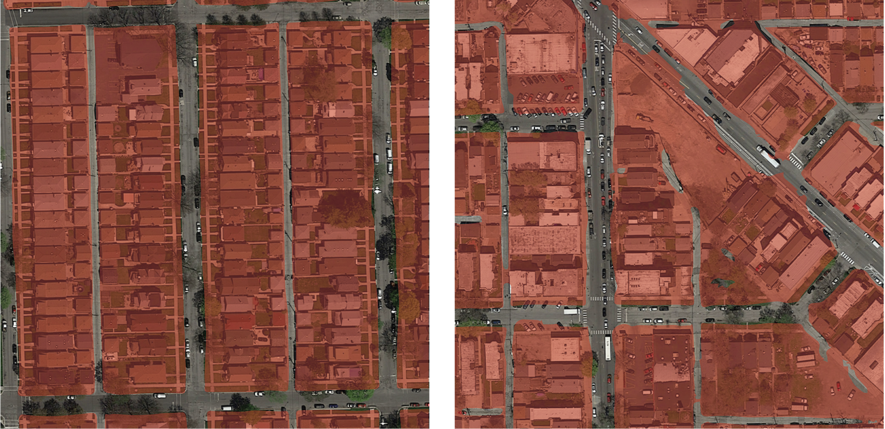

# Road segmentation with Neural Networks

_Vincent Ballet - Paul Nicolet - Alexandre Rassinoux_


This project presents a solution to segment satelite images by detecting roads.
The classifier consists of a particular type of Convolutional Neural Network called [UNet](https://arxiv.org/abs/1505.04597) which outputs for each pixel of an input image whether or not it is considered being part of a road.

At the end, the model trained on 100 augmented images obtain a decent accuracy of 94.5% on the test set.  

This project has been developed in the context of the Machine Learning class (CS-433) at EPFL.

Here is an example of the classfication result for two test images: 



## Dependencies
Training the model requires the following libraries: 

* numpy v1.13.3
* pytorch v0.3.0
* scikit-learn v0.19.1
* imgaug 0.2.5

Experimenting with the provided notebooks requires additional libraries: 
* matplotlib v2.1.0
* torchvision v0.1.9


## Using and training the model

It is possible to use the pre-trained model or train it from scratch. In both cases, the model generates predictions for the test set and the Kaggle submission file:

```python run.py [-train] [-cuda] [-gpu2]```

Options: 
* `-train` train model from scratch (default is loading best model)
* `-cuda` enable training on GPU if available
* `-gpu2` use second GPU instead of first one if available

**Execution times:**
* Prediction with pre-trained: < 1 minute
* Training from scratch with GPU NVIDIA TITAN X: ~ 4 hours

Note that the project does not contains data, available on [Kaggle](https://www.kaggle.com/c/epfml17-segmentation/data). It is necessary to create the same layout than described above.

## Project structure
<pre>
.
├── README.md
├── checkpoints                             Trained models as .pt file
├── data            
│   └── train
│       ├── groundtruth                     Label images (400x400)
│       └── images                          Satelite images (400x400)
|   └── test
│       ├── predictions                     Predicted label images (608x608)
│       └── images                          Satelite images (608x608)
├── plots   
├── report                                  Final report
├── src                                     Source files (descriptions are in files directly)
│   ├── datasets                        
│   │   ├── aerial_dataset.py
│   │   └── patched_aerial_dataset.py
│   ├── helpers
│   │   ├── cross_val.py
│   │   ├── prediction.py
│   │   ├── search.py
│   │   ├── training.py
│   │   └── training_crossval.py
│   ├── kaggle
│   │   └── mask_to_submission.py
│   ├── models
│   │   └── rsm.py
│   │   └── uNet.py
│   ├── notebooks
│   │   ├── Pipeline.ipynb
│   │   ├── Pipeline_crossval.ipynb
│   │   ├── cnn.ipynb
│   │   ├── forest.ipynb
│   ├── postprocessing
│   │   ├── graph.py
│   │   ├── majority_voting.py
│   │   └── vectors.py
│   ├── preprocessing
│   │   ├── augmentation_config.py
│   │   ├── channels.py
│   │   ├── labeling.py
│   │   ├── loading.py
│   │   ├── patch.py
│   │   ├── prepare_images.py
│   │   └── rotation.py
│   ├── run.py                          Main file to train and generate predictions
│   └── visualization
│       └── helpers.py
└── submissions                         Generated CSV submissions for Kaggle
</pre>